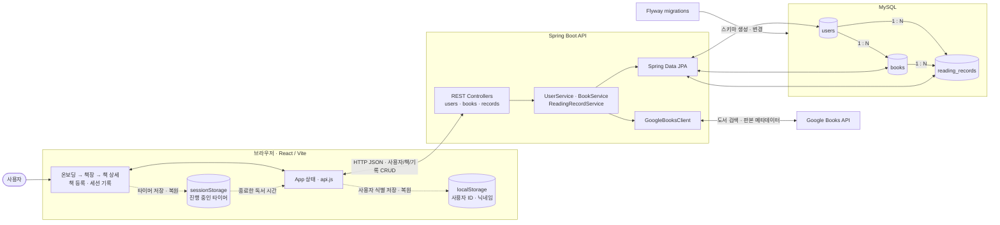

# hub

읽은 책과 생각을 나만의 서재에 쌓고, 마지막 책갈피에서 다음 독서를 다시 시작하게 돕는 PC 웹 서비스입니다.

## 프로젝트 방향

- 책을 읽고 싶지만, 매번 어디부터 다시 읽을지 망설여 독서를 미루는 대학생을 위한 서비스입니다.
- 사용자가 책 한 권의 마지막 책갈피, 짧은 감상, 읽은 페이지를 확인하고 바로 이어 읽게 만드는 데 집중합니다.
- 타이머로 집중을 감시하거나 증명하지 않습니다. 타이머는 독서 시작을 돕는 선택적 보조 도구입니다.

## 핵심 컨셉

- 사용자는 읽고 있는 책을 내 책장에 등록합니다.
- 책을 열면 지난번 마지막 페이지와 세션별 짧은 기록 페이지를 확인할 수 있습니다.
- 이번에 읽은 페이지와 감상을 남기면, 다음 시작 페이지가 갱신되고 책이 다시 책장에 쌓입니다.
- 완독하면 책의 마지막 서평 페이지가 열리고, 그동안의 세션 기록을 한 권의 독서 노트로 돌아볼 수 있습니다.
- 세션 기록에는 감상뿐 아니라 마음에 남은 글귀를 직접 입력하거나 사진 OCR로 가져오고, `위안`, `슬픔`, `따뜻함`, `깨달음` 같은 생각 태그를 선택적으로 남길 수 있습니다.
- 나중에는 책 단위가 아니라 세션 단위로 태그를 탐색해, 여러 책에 흩어진 감상과 글귀를 필요한 순간에 다시 모아볼 수 있습니다.
- 기존의 신뢰도 점수 대신 `읽기 기록 달력`과 개인의 `독서 발자취`를 다룹니다. 경쟁이나 출석 평가가 아니라 다시 독서로 돌아온 리듬을 보여 주는 정보입니다.

## 핵심 루프

```text
책을 책장에 등록한다
-> 지난 책갈피에서 책을 다시 연다
-> 필요하면 타이머를 켜고 읽는다
-> 세션 기록 페이지 한 장을 남긴다
-> 다음 페이지부터 다시 읽는다
```

세션 기록은 자동으로 정해진 시작 위치와 사용자가 입력한 `끝난 페이지`, 선택적인 `짧은 감상`으로 구성됩니다. P2부터는 직접 입력하거나 OCR로 추출한 `마음에 남은 글귀`와 선택적인 `생각 태그`도 같은 세션에 저장합니다. 한 권의 책에 세션 기록 페이지가 쌓이고, 긴 서평은 완독 뒤 마지막 페이지에서 남깁니다.

## 데이터 흐름과 아키텍처

현재 구현을 기준으로 한 전체 구조입니다. 실선은 사용자의 요청과 영구 데이터 흐름, 점선은 브라우저 안에만 남는 임시 데이터 흐름입니다.



사용자는 React 화면에서 온보딩, 책장, 책 상세와 기록 흐름을 이용합니다. 클라이언트의 모든 서버 요청은 `api.js`를 거쳐 Spring Boot 컨트롤러와 서비스로 전달되고, 영구 데이터는 JPA를 통해 MySQL의 `users`, `books`, `reading_records`에 저장됩니다. 도서 검색과 등록 때만 서버가 Google Books API를 호출하므로 API 키는 브라우저에 노출되지 않습니다. 사용자 식별 정보와 진행 중인 타이머만 브라우저 저장소에 남고, 기록 저장 뒤에는 책 상세와 세 책장 상태를 다시 조회해 서버 데이터를 화면의 기준으로 삼습니다.

### 확인하며 발견한 다음 작업

| 발견 | 현재 영향 | 다음 작업 |
| --- | --- | --- |
| 사용자 ID를 `localStorage`와 요청 값으로 신뢰합니다. | 브라우저 데이터를 지우면 기존 책장을 복구할 수 없고, 다른 사용자 ID를 알면 소유권 검사를 통과할 수 있습니다. | 계정 복구나 공유 기능 전에 서버 세션 기반 인증을 넣고 요청 본문의 `userId`를 제거합니다. |
| 책장 진입과 기록 변경 때 상태별 책장 API를 3번 호출하고, 서버는 각 책마다 기록 수와 최신 기록을 조회합니다. | 책이 늘면 요청 수와 DB 조회 수가 함께 증가합니다. | 실제 지연이 확인되면 한 번의 책장 조회와 집계 쿼리로 합칩니다. |
| 책 상세 화면이 URL이 아닌 React 상태로만 열립니다. | 새로고침, 브라우저 뒤로 가기, 상세 링크 공유로 같은 화면을 복원할 수 없습니다. | 상세 링크가 필요해질 때 `/books/:bookId` 경로를 화면 상태의 기준으로 만듭니다. |

## 현재 우선순위

- 첫 수직 슬라이스는 `책 등록 → 읽는 중 책장 조회 → 세션 기록 저장 → 다음 시작 페이지부터 재개`입니다.
- 프론트엔드는 React로 책장, 책 상세, 세션 기록 흐름을 먼저 검증합니다.
- 백엔드는 Spring Boot, MySQL, Flyway로 책과 세션 기록을 저장·조회하는 API를 구현합니다.
- P1에서는 완독 서평, 선택적 타이머, GitHub 잔디형 읽기 기록 달력, 잠시 보관하기와 마지막 기록 정정을 추가합니다.
- P2에서는 사진 OCR 글귀 저장, 생각 태그, 세션 기록 모아보기, 독서 발자취와 책장 꾸미기를 추가하고, 친구 서재는 이후 단계로 둡니다.

## 계획 문서

- 이번 주 실행 작업은 [Week 2 Issue Board](https://github.com/Tapha-K/hub/issues)에서 관리합니다.
- 상위 로드맵과 단계별 우선순위는 [프로젝트 Wiki](https://github.com/Tapha-K/hub/wiki)에서 관리합니다.
- 남은 3주 MVP 실행 계획은 [Sprint Backlog](https://github.com/Tapha-K/hub/wiki/Sprint-Backlog)의 Week 2~4 작업을 기준으로 합니다.
- 장기 제품 백로그는 [Product Backlog](https://github.com/Tapha-K/hub/wiki/Product-Backlog)에서 관리합니다.
- 프론트엔드 로드맵은 [Frontend Priority Roadmap](https://github.com/Tapha-K/hub/wiki/Frontend-Priority-Roadmap)을 기준으로 합니다.
- 백엔드 로드맵은 [Backend Priority Roadmap](https://github.com/Tapha-K/hub/wiki/Backend-Priority-Roadmap)을 기준으로 합니다.
- 코드와 함께 유지해야 하는 MVP 구현 상세 문서는 이 저장소에 남깁니다.

## 구현 문서

- [AI Collaboration Workflow](AI_WORKFLOW.md): 3주간의 작업 순서, 사용한 Skill·Agent 역할, 발표 진행안을 정리합니다.
- [Product PRD](client/docs/product-prd.md): Wiki P0/P1 범위를 PC 웹 MVP 요구사항으로 구체화합니다.
- [Frontend User Flow](client/docs/user-flow.md): MVP 화면 단계와 사용자 흐름을 정리합니다.
- [Click Unit UI Specification](client/docs/click-unit-ui-spec.md): 화면별 클릭, 모달, 상태 변화를 클릭 단위로 정의합니다.
- [Component Implementation Notes](client/docs/component-implementation-notes.md): 컴포넌트별 책임, props/state, handler, 표시 조건을 정리합니다.
- [P0 API Contract](client/docs/p0-api-contract.md): React와 Spring Boot가 공유할 사용자·책·세션 기록 API 계약을 정리합니다.
- [Reading Bookshelf Expert Brainstorm](client/docs/archive/reading-bookshelf-expert-brainstorm.md): 디자이너와 프론트엔드 관점의 새 콘셉트 브레인스토밍 기록입니다.
- [Reading Bookshelf User Review](client/docs/archive/reading-bookshelf-user-review.md): 첫 방문·재방문 사용자 관점 검토와 범위 합의 기록입니다.
- [Docs Archive](client/docs/archive): 토론 기록과 UX 검토처럼 구현 기준은 아니지만 의사결정 근거로 보관할 문서를 둡니다.
